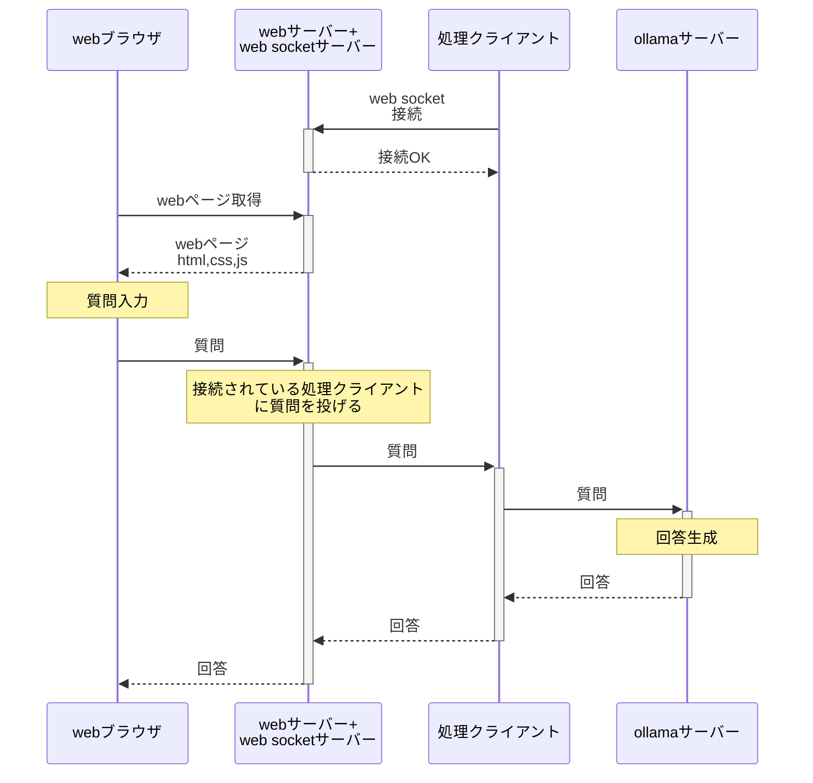

# LLMのデモを行うための中継サーバーアプリ

## 構成図

## インターネット上の サーバー

VPS内の webサーバー + web socketサーバー.
インターネット上に高価な GPUサーバーを借りることなくGPUの必要なwebアプリの
デモなどを行うことができる.(処理クライアント側にGPUが必要).

自宅などにGPUマシンが必要

### インターネット上のサーバーの機能

* web ブラウザからの接続に対してhtml,css,js などを返す。
* webブラウザから api 問い合わせ
* 処理クライアントからweb socket接続される。
* webブラウザからの処理要求は接続されている処理クライアントで処理を行われる。
* 拡張できるようにしたい. 詳細な機能は未定

### インターネット上のサーバーのフレームワーク

現状 python fastAPI を考えていますが、nodejs,rust,go などにするかもしれません.

## 処理クライアント

インターネット上のwebサーバー+web socketサーバーに  web socket接続して
処理サーバーとして登録し、 webブラウザからの処理要求を処理する。

# シンプルなLLMチャットの場合のシーケンス

# 作りたいものとフレームワーク

今使おうと思っているものですが、変えるかもしれません

* webブラウザで表示するコンテンツ
    * vuejs もしくは react もしくは nextjs
* インターネット上の サーバー
    * fastAPI もしくは nodejs
* 処理クライアント
    * fastAPI もしくは内容ごとに変える
* LLm サーバー  
    * ollama, llama.cpp など
    * ものによっては 処理クライアントから直接python実行

