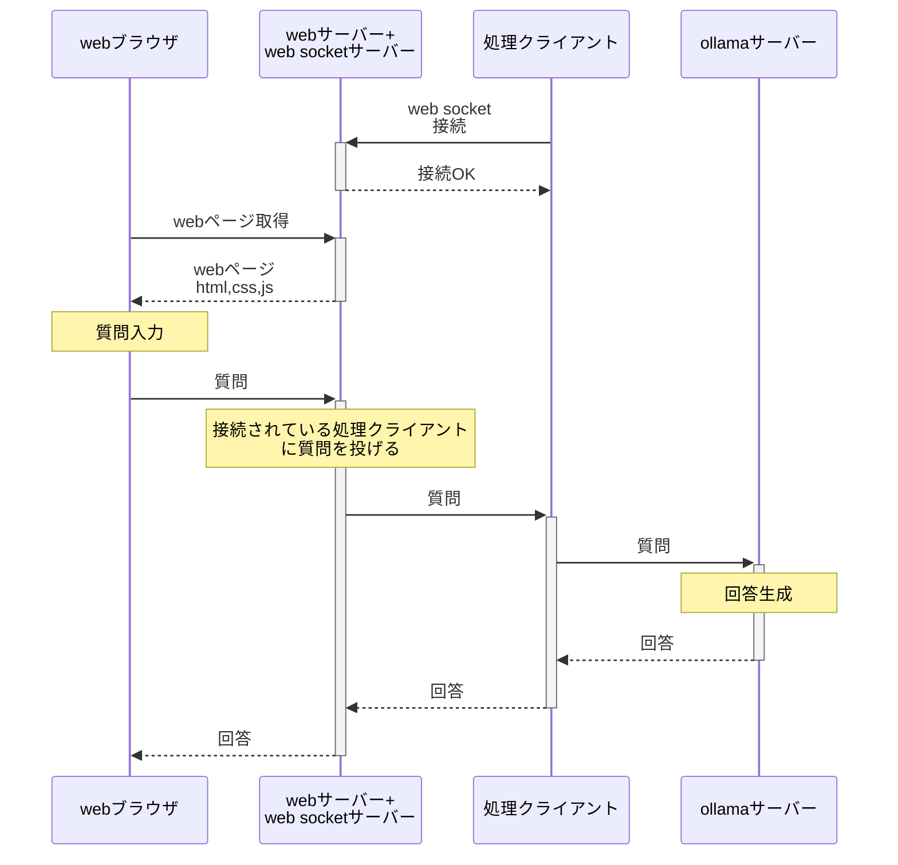

# LLMのデモを行うための中継サーバーアプリ

## 構成図

## インターネット上の サーバー

VPS内の webサーバー + web socketサーバー.
インターネット上に高価な GPUサーバーを借りることなくGPUの必要なwebアプリの
デモなどを行うことができる.(処理クライアント側にGPUが必要).

自宅などにGPUマシンが必要

### インターネット上のサーバーの機能

* web ブラウザからの接続に対してhtml,css,js などを返す。
* webブラウザから api 問い合わせ
* 処理クライアントからweb socket接続される。
* webブラウザからの処理要求は接続されている処理クライアントで処理を行われる。
* 拡張できるようにしたい. 詳細な機能は未定

### インターネット上のサーバーのフレームワーク

現状 python fastAPI を考えていますが、nodejs,rust,go などにするかもしれません.

## 処理クライアント

インターネット上のwebサーバー+web socketサーバーに  web socket接続して
処理サーバーとして登録し、 webブラウザからの処理要求を処理する。

# シンプルなLLMチャットの場合のシーケンス

# 作りたいものとフレームワーク

今使おうと思っているものですが、変えるかもしれません

* webブラウザで表示するコンテンツ
    * vuejs もしくは react もしくは nextjs
* インターネット上の サーバー
    * fastAPI もしくは nodejs
* 処理クライアント
    * fastAPI もしくは内容ごとに変える
* LLm サーバー  
    * ollama, llama.cpp など
    * ものによっては 処理クライアントから直接python実行

先日の忘年会のようなときに
LLMなどのアプリのデモなどを行いたいと思った場合に、
インターネット上に GPUサーバーを借りずにデモを行う構成
を考えてみました。

この中継サーバー、処理クライアントを
作って見ようと思っているのですが、
LLMの勉強がてら、プログラミング言語、フレームワークの勉強がてら
一緒に作ってやっても良いと言う方はいらっしゃいますでしょうか？

プログラミング言語、フレームワークは自由に選んでいただいても
構いません。構成は相談しながら変えていきたい。

# 実装検討

* web ブラウザは WSサーバーに接続(query endpoint)
* workerクライアントは WS サーバーに接続(worker endpoint).自分の処理にあったendpointに接続
* 1: MCPの様に関数名とパラメータを query endpoint に投げる
* 2: query end point は 関数名にしたがって該当する処理 queue に保存
    * websocket object とJSONで保存
* worker endpoint はキューを監視してキューに objectがあれば workerクライアントに送信
    * worker側もキューにしても良いかも（検討中)
* サーバーのworker endpoint は　JSON と ws obj を受け取ってworker に処理をなげる。
* サーバーのworker endpoint は処理結果を受け取って ws obj に投げる
    * web ブラウザにws で結果を投げることになる

* web ブラウザに toolcalling のLLM を搭載するか、
* WS サーバーにtoolcalling の task として投げて受け取った回答をもとに もう一度WSに投げるか